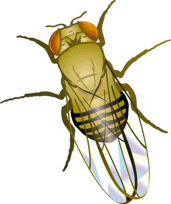

class: title, fogscreen
<!-- slide -->

# Organizing Data Science Projects

## .gray[NIH BYOB, 2019-08-22]

---
.myheader[\>About]

## .center[Justin M Fear]

.fl.db.w-50pct[
- IRTA Fellow (NIDDK/NIH)
    - <i class="fas fa-dna"></i> Genomics
    - <i class="fas fa-project-diagram"></i> Gene Regulation
    -  Drosophila

- Contact:
    - <i class="fab fa-github"></i> @jfear
    - <i class="fas fa-envelope-open-text"></i> justin.fear@nih.gov
    - <i class="fab fa-slack"></i> Justin Fear@nih-byob.slack.com

]

.fr.db.w-50pct[
- Slides are at:
    - <http://talks.geneticsunderground.com>
.qrcode.db.pa-3.w-90pct.ml-4[]
]

---
class: title, smokescreen
background-image: url(organization.jpg)

<!-- ############################ Part 1 ############################ -->
# Why Project Organization

---
layout: true
.myheader[\>Reason for project organization\>Your-self]

---


.absolute.db.w-50pct.l-50pct[

# Find things quickly

## (≤ 10 min)

.ul-space[
* Find the exact code used to generate result
* Tweak a plot
* Jump back into a project picking up where you left off
]
]

---


.absolute.db.w-50pct.l-50pct[
# Reuse code

## Automate the boring stuff

.ul-space[
* Standardized workflows
* Modularize code for testing, maintenance, and usability
* Save brain power for fun tasks
]
]

---


.absolute.db.w-50pct.l-50pct[
# Share code and results

.ul-space[
* Quickly show a collaborator what you did
* Summarize side analyses for archive
]
]

---


.absolute.db.w-50pct.l-50pct[
# Recover from data disasters

.ul-space[
* Oops we swapped sample names now you need to re-run
* We forgot to tell you about these addition 10 samples
* The file we sent you was truncated
]
]

---
layout: true

---
class: img-caption


# Reproducible Research

---
class: title, smokescreen
background-image: url(https://summary.org/wp-content/uploads/2018/12/Messy02.jpeg)

<!-- ############################ Part 2 ############################ -->

# Have you seen this?

## Please don't do this


---
layout: true
.myheader[\>Please don't do this]

---
class: compact

# Poor uses of file names

.fl.db[
<pre><code class="Shell">
.
<mark class="highlight">├── deg_jmf_final_v2.sh</mark>
├── deg_lmm_final.sh
├── deg_lmm_v1.sh
├── deg_lmm_v2.sh
├── deg_step1_jmf_v1.sh
<mark class="highlight">├── deg_step2a_jmf_v1.sh</mark>
├── deg_step2_jmf_v1.sh
├── deg_step3_jmf_v1.sh
├── deg_step3_jmf_v2.sh
├── deg_step3_lmm_v1.sh
├── download_data_v1.sh
└── download_data_v2.sh
</code></pre>
]

.fr.db.w-60pct[
* File names are not great for version control
> If you name something final, you will always have another version.
* File names are not great at ordering steps in a workflow
> Adding or re-ordering steps is confusing at best.
]

.absolute.w-6-12th.pa-3.l-5-12th.t-70pct.ba.bw-3.br-4.bg-white-60pct[
Make file names descriptive and concise.
]

---
class: compact


.fr.db.w-50pct[
# Poor uses of folders

* One folder to rule them all

> For small projects you can get by with putting everything in a single
> folder. But, once you have more than 20 files it is hard to find things.
> Using search is only useful if you know what you are searching for.

* Too many folders

> As above, once you get more than 20 or so folders is becomes hard to find things.
]

.absolute.w-6-12th.pa-1.l-5-12th.t-10-12th.ba.bw-3.br-4.bg-white-60pct[
Make your own folder hierarchy and stick to it.
]

---
class: compact

# Poor uses of scripts

.fl.db[
<pre><code class="Bash">
# Run this part first
# bunch of lines of code

# Run this part second
# bunch of lines of code

# Run this part third
<mark class="highlight">bunch of lines of code</mark>

# Run this part fourth
# bunch of lines of code
</code></pre>
]

.fr.db.w-60pct[
* Don't comment and uncomment parts of script
> Your-future-self will have no clue what was actually run
* Don't copy and paste from a script
> Beginners often has scripts with lots of comments describing each step.
> They the copy and paste from the script onto the command line. Like
> commenting and uncommenting you may not know exactly what you did.
]

---
layout: true

---
class: title, smokescreen
background-image: url(http://www.freestufffinder.com/wp-content/uploads/2018/08/tina-marie-kondo-folding-method.jpg)

# How to get organized

<!-- ############################ Part 3 ############################ -->

---
class: img-left-full, compact


# Tools of the trade (VCS)

## Version Control Software

* Use VCS such as git

> VCS is like MS Words track changes

* Use the cloud to store to your code

> Github, GitLab, and Bitbucket are common places to store
> your version controlled code.

> You can make code private or public, and it is available 
> anywhere with internet.

---
class: compact

# Tools of the trade (Workflows)


.absolute.t-8-12th[
* Orchestrate analysis using workflow software
    - Galaxy
    - Make
    - Snakemake
]

---


.fr.db.w-40pct[

# Project Folder Organization

.ul-space[
* Folder structure is personal preference
* Folder names are personal preference

## There are general .red[*best practices*]
]
]

---
class: compact, fit-h1


.fr.db.w-40pct[
## 1. Use the same folder structure and names across projects

* Everything has its place
* You can quickly move between projects
]


---
class: compact

# 2. Separate original data, generated data, and scripts

## .red[Not stored in version control]

.fl.db.w-40pct[
```bash
├── data # original and external
├── lcdb-references # multi-project
├── output # generated output
│   ├── example1-wf
│   ├── example2-wf 
│   └── paper_submission-wf
```
* Improves mobility
* Delineates what you generated
* Allows reuse of common data across projects

]

.fr.db.w-55pct[
```bash
data # original and external
├── external
│   ├── DroID_DPiM_2018-03-29.txt # website
│   ├── Ferrari_et_al_2006.tsv # paper
│   ├── Ferrari_et_al_2006.readme # paper details 
│   ├── FlyBase/ # community
│   └── maria/ # collaborator
├── rnaseq_samples # our data
│   ├── ...
│   └── w1118_LG_m_r4_B_C12.fastq.gz
└── singleCellSeqData # out data
    ├── ...
    └── SV_9_10X_Te/
```

]

---
.absolute.l-2.w-30pct[
## 3. Uses workflows to orchestrate

```bash
./example1-wf
├── config
│   ├── config.yaml
│   └── sampletable.tsv
├── scripts/
└── Snakefile
```
]


---
.absolute.l-2.w-40pct[
## 4. Modularize reusable code

```bash
lcdb-wf@56c948d  #submodules
src/    # project level package
├── my_project
│   ├── io.py
│   ├── plotting.py
│   └── stats.py
├── tests/
│   ├── test_io.py
│   └── test_stats.py
└── setup.py
```
]


---
class: compact

.absolute.l-2.w-40pct[

## 5. Use a style guide and linters

* Consistent style improves readability
* Just google my language and style guide
* Linters catch syntax erros and point out style problems.
    - `flake8   # python`
    - `lintr    # R`

* Fix ugly code with software
    - `black   # python`
    - `styler   # R`
]

.fr.db.w-50pct[
<pre><code class="R" style="font-size: .9rem">
for (i in seq(10)) {
for (j in seq(100)) {
if (i == j) {
print(TRUE)
} else if (i %% j == 0) {
print("modulo")
} else {
print(FALSE)
}
}
}
</code></pre>

<pre><code class="R" style="font-size: .9rem">
for (i in seq(10)) {
  for (j in seq(100)) {
    if (i == j) {
      print(TRUE)
    } else if (i %% j == 0) {
      print("modulo")
    } else {
      print(FALSE)
    }
  }
}
</code></pre>
]

---
class: compact
# 6. Split out configuration for consistency

.absolute.l-2.w-40pct[
```bash
./config   # Project config
    ├── common.yaml
    ├── gene_sets.yaml
    └── colors.yaml

./example1-wf   # Workflow config
    ├── config
    │   ├── config.yaml
    │   └── sampletable.tsv

```
]

.fr.db.w-50pct[
## Project config

Contains info that is needed across the project.

* Project name and github url
* Assembly and Annotation
* alpha level

## Workflow config

Anything you may tweak in the future.

* Various thresholds
* Workflow specific references
* Various Mappings (i.e. file name to title)

]

---
class: fit-h1, compact
# 7. Use containers and environments (portability and reproducibility)

One of the hardest problems in data science is managing software.

.absolute.l-2.w-40pct[
```bash
./environment.yaml  # project env

./envs   # specific tools conda envs
    ├── deseq2.yaml
    ├── scrublet.yaml
    ├── seurat2.yaml
    └── seurat3.yaml


```
]

.fr.db.w-50pct[
## Containers (Docker, Singularity)

* Completely reproducible system
    * Kernel and Software

## Environments (Conda, pipenv)

* Install and manage software versions
* Different versions of software can be installed in different environments

]

---
class: title, smokescreen
background-image: url(https://www.mayerdan.com/assets/img/ring-binders.jpg)

# 8., 9., 10. Documentation

## What is not documented, stays not documented

<!-- ############################ Part 4 ############################ -->

---
# What to document (Everything!)

.ul-space[
* How was the data generated
* Record all "experiments"
.red[
- failed attempts
- comparing different methods
]
* Record the reasoning for any decision points
* Clearly describe how to get final results
]

**6 months from now, your future-self will thank you!**

---
# Where to document (Everywhere!)

.ul-space[
* Sample/Resource Table
* README
* Top of scripts
* Function/Class Docstrings
* Code comments (but not too many)
* Literate Programming (i.e. notebooks)
* Project Blog
]

---
layout: true
.myheader[\>Where to document]

---
class: compact

# Sample Table

```bash
./example1-wf
    ├── config
    │   ├── config.yaml
    │   └── sampletable.tsv
```

| samplename | orig_filename         | group | wellID | row | col | num_parts | sex | testis | ovary | fatbody | ercc |
|------------|-----------------------|-------|--------|-----|-----|-----------|-----|--------|-------|---------|------|
| A1_OCP     | ....A1_OCP_1.fastq.gz | OCP   | A1     | A   | 1   | 25        | f   | 0      | 1     | 0       | A    |
| A6_TCP     | ....A6_TCP_2.fastq.gz | TCP   | A6     | A   | 6   | 15        | m   | 1      | 0     | 0       | B    |

Add as much information about your samples.

---
# Top of Scripts

.fl.db.w-50pct[
.ul-space[
* Describe what the script does
* Any major decisions that you made
* Anything to help you remember
]
]


---
# Functions and Classes

.fl.db.w-50pct[
.ul-space[
* Any function you will call from another script.
* Add type hints if it is confusing what goes in.
* Add examples to clearly show what the function does.
]
]


---
# Literate Programming

.fl.db.w-50pct[
```bash
./notebook
    ├── 2019-08-01_bulk_deg.Rmd
    └── 2019-08-10_bulk_ma.ipynb

./docs
    ├── cell_number_counts.ipynb
    └── permutation_summary.ipynb
```

.ul-space[
* Jupyter Notebooks
* R Notebooks and Rmarkdown
]
]


.footer[https://github.com/markusschanta/awesome-jupyter]

---
# Dedicated Project Blog

.ul-space[
* Aggregate notebooks
    - `bookdown  # R`
    - `jupyter webbook  # python`
* Various static site generators
    - Pelican
    - Nikola
    - jekyll
    - **hugo**
]


---
# 10 Best Practices

<ol>
<li>Use the same structure and names across projects</li>
<li>Separate original data, generated data, and scripts</li>
<li>Use workflows to orchestrate</li>
<li>Split out configuration for consistency</li>
<li>Modularize reusable code</li>
<li>Use a style guide and linters</li>
<li>Use containers and environments</li>
<li style="font-size: 1em;">Document as you go</li>
<li style="font-size: 1.2em;">Document as you go</li>
<li style="font-size: 1.6em; font-weigth: bold">Document as you go!</li>
</ol>

---
class: title, fogscreen
background-image: url(http://www.paautism.org/LinkClick.aspx?fileticket=A1L9cYFyoTg%3D&tabid=101&portalid=0&mid=771&language=en-US)

# Resources

---
layout: true

---
.myheader[\>Resources]
* Cookiecutter
* Github
* Bitbucket
* Snakemake
* Data Science git-flow
