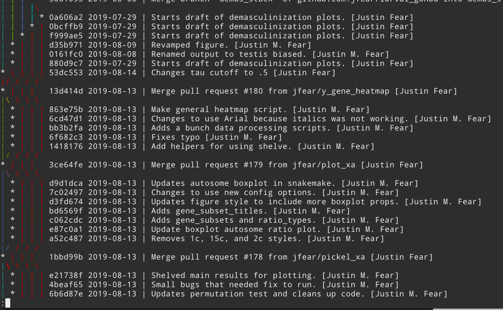

class: title
background-image: url(cover.jpg)
<!-- slide -->

# Organizing Data Science Projects

## .gray[NIH BYOB, 2019-08-22]

---
class: compact
<!-- slide -->
.myheader[\>About]

## .center[Justin M Fear]

.fl[
- IRTA Fellow (NIDDK/NIH)
    - <i class="fas fa-dna"></i> Genomics
    - <i class="fas fa-project-diagram"></i> Gene Regulation
    -  Drosophila

- Contact:
    - <i class="fab fa-github"></i> @jfear
    - <i class="fas fa-envelope-open-text"></i> justin.fear@nih.gov
    - <i class="fab fa-slack"></i> Justin Fear@nih-byob.slack.com

]

.fr[
- Slides are at:
    - <http://talks.geneticsunderground.com>

]

---
class: img-left-full, compact, fit-h1
<!-- slide -->

# Why Project Organization


.bq-shrink[
> “Science is a self-correcting process. To be accepted, new ideas must
> survive the most rigorous standards of evidence and scrutiny.”

> -- Carl Sagan 1980
]

## Reproducible research

* Easy to find what was done
* Main results are reproducible

## Better science

* Pull methods from old projects
* Share code with collaborators and the outside world

## Team development

---
layout: true
<!-- layout slide -->

.myheader[\>Why Project Organization]

---
<!-- slide -->
.fl.w-50pct[
<figure>

<figcaption><i>Your future-self is tireder, busier, and dumber.</i></figcaption>
</figure>
]

.fr.w-50pct.ul-space[
## If nothing else, stay organized for your future-self.

* Will you know what you did 6 months from now?
* When you get an additional sample how long will it take to re-run?
* Can you easily recover when your collaborator realizes they swapped sample labels?
* ...
]

---
layout: true
<!-- layout slide -->
.myheader[]

---
class: compact
<!-- slide -->
.myheader[\>Don't do this]

# Have you seen this?

.fl.db[
## File name versioning
<pre><code class="Shell">
.
<mark class="highlight">├── deg_jmf_final_v2.sh</mark>
├── deg_lmm_final.sh
├── deg_lmm_v1.sh
├── deg_lmm_v2.sh
├── deg_step1_jmf_v1.sh
<mark class="highlight">├── deg_step2a_jmf_v1.sh</mark>
├── deg_step2_jmf_v1.sh
├── deg_step3_jmf_v1.sh
├── deg_step3_jmf_v2.sh
├── deg_step3_lmm_v1.sh
├── download_data_v1.sh
└── download_data_v2.sh
</code></pre>
]

.fr.db[
## Commenting and uncommenting
```bash
# Run this part first
# ...

# Run this part second
# ...

# Run this part next
...
```
]

---
<!-- slide -->
.myheader[\>Do this]

# Tools of the trade

.fl.db.w-50pct[
## Version Control System

<figure>

<figcaption><i>Git and github are your friends.</i></figcaption>
</figure>

]

.fr.db.w-50pct[
## Workflow Managment System

<figure>

<figcaption><i>Snakemake changed my life.</i></figcaption>
</figure>

]

---
layout: true
.myheader[\>Project Folder Organization]

---
class: smokescreen, roomy
<!-- slide -->

# Project Folder Organization

.ul-space[
* Folder structure is personal preference
* Folder names are personal preference
* However, there are **general best practices**
]

---
# 10 Best Practices

<ol>
<li>Use the same structure and names across projects</li>
<li>Keep original data, generated data, and scripts separate</li>
<li>Use workflows to orchestrate</li>
<li>Modularize reusable code</li>
<li>Use a style guide and linters</li>
<li>Split out configuration for consistency</li>
<li>Use containers and environments for portability and reproducibility</li>
<li style="font-size: 1em;">Document as you go</li>
<li style="font-size: 1.2em;">Document as you go</li>
<li style="font-size: 1.6em;">Document as you go!</li>
</ol>

---
class: compact

# My folder structure

```bash
# Keep data separate
├── data -> /home/fearjm/...
├── lcdb-references -> /home/fearjm/...
├── output -> /home/fearjm/data/fearjm/...
# Modularize reuseable code
├── src/         # Project specific library
├── lcdb-wf/     # Git Submodule (general workflows)
├── wrappers/    # Generalized wrappers I can use in other projects
# Use workflows for orchestration
├── bulk-rnaseq-wf/
├── cellranger3-wf/
├── paper_submission-wf/
├── scripts/    # top level scripts
├── Snakefile   # Top level workflow
```

---
# My folder structure (cont)

```bash
# Split out configuration
├── config/
├── example-wf
    ├── config
# Use containers and environments for portability
├── environment.txt
├── envs/
# Document as you go
├── docs/
├── notebook/
```

---
# Use the same folder structure and names across projects

* Your future-self will know where to look
* If you work in teams then everyone knows where to look
* No cognitive overhead, just rinse and repeat


---
class: compact

# Keep original data, generated data, and scripts separate

## .red[Not stored in version control]

.fl.db.w-40pct[
```bash
├── data # original and external
├── lcdb-references # multi-project
├── output # generate output
```

* Improves mobility
* Delineates what you generated
* Allows reuse of common data across projects

.bq-shrink[
> I work on multiple computers.
> I store data in a single location and mount the drive remotely.
> I can do more locally instead of messing with Biowulf.
]

]

.fr.db.w-55pct[
```bash
data # original and external
├── external
│   ├── DroID_DPiM_2018-03-29.txt # website
│   ├── Ferrari_et_al_2006.tsv # paper
│   ├── Ferrari_et_al_2006.readme # paper details 
│   ├── FlyBase/ # community
│   └── maria/ # collaborator
├── rnaseq_samples # our data
│   ├── ...
│   └── w1118_LG_m_r4_B_C12.fastq.gz
└── singleCellSeqData # out data
    ├── ...
    └── SV_9_10X_Te/
```

]

---
# Use workflows to orchestrate

---
# Modularize reusable code

---
# Use a style guide and linters

---
# Split out configuration for consistency

---

# Use containers and environments for portability and reproducibility

---
# Document as you go

---
