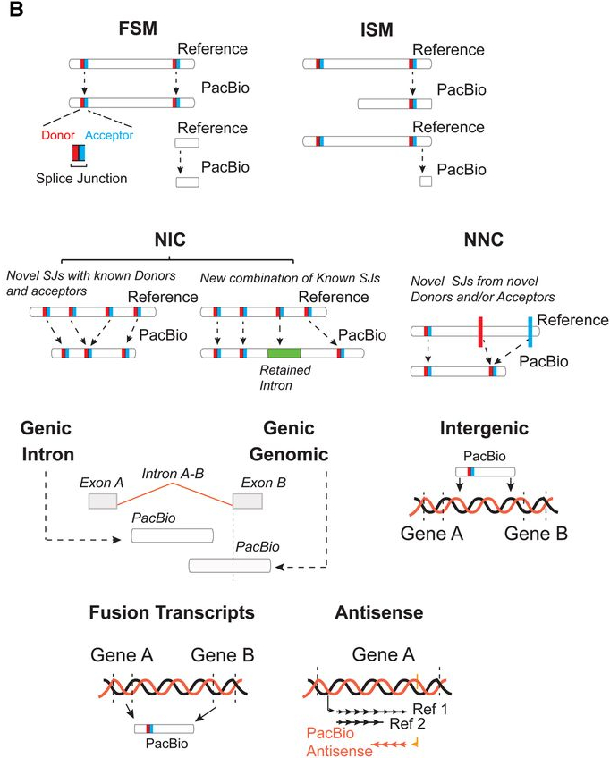

class: title, smokescreen, shelf, no-footer
background-image: url(cover.png)

# SRA Update (PacBio)
### June 3, 2019

---

class: col-2

# Adult vs Larval Testis
<!-- TODO: update counts -->

*Adult*
* XX testes
* PacBio RSII
* 3 Size Fractions
* XX Reads
* 4,532 Genes Covered
* 8,053 Isoforms Covered

*Larval*
* XX testes
* PacBio Sequel
* 2 Size Fractions
* XX Reads
* 10,042 Genes Covered
* 36,642 Isoforms Covered

---

class: col-2

# Summary: Gene Classification

*Adult*

| category        | # genes |
|-----------------|---------|
| Annotated Genes | 4,477   |
| Novel Genes     | 55      |

*Larval*

| category        | # genes |
|-----------------|---------|
| Annotated Genes | 9,166   |
| Novel Genes     | 876     |

---

class: col-2

# Summary: Splice Junction Classification

*Adult*

| category            | # SJs  |
|---------------------|--------|
| Known canonical     | 13,013 |
| Known Non-canonical | 8      |
| Novel canonical     | 454    |
| Novel Non-canonical | 229    |

*Larval*

| category            | # SJs  |
|---------------------|--------|
| Known canonical     | 24,857 |
| Known Non-canonical | 19     |
| Novel canonical     | 3,216  |
| Novel Non-canonical | 1,714  |

---

class: col-3, compact

# Summary: Transcript Classification

*Adult*

| category         | # SJs |
|------------------|-------|
| FSM              | 5,225 |
| ISM              | 1,355 |
| NIC              | 640   |
| NNC              | 561   |
| Genic Genomic | 162   |
| Fusion           | 51    |
| Antisense        | 22    |
| Intergenic       | 20    |
| Genic Intron  | 17    |

*Larval*

| category         | # SJs  |
|------------------|--------|
| FSM              | 13,359 |
| ISM              | 12,625 |
| NIC              | 4,098  |
| NNC              | 3,373  |
| Genic Genomic | 1,863  |
| Fusion           | 407    |
| Antisense        | 404    |
| Intergenic       | 293    |
| Genic Intron  | 220    |

.footer[(FSM) Full Splice Match; (ISM) Incomplete Splice Match; (NIC) Novel in Catalog; (NNC) Novel Not in Catalog -- Manuel et al. 2018. *Genome Research*.] 

---

class: col-2, compact

# Summary: Distribution of Isoforms Per Gene

*Adult*

*Larval*

---

class: col-2, compact

# Examples of Novel Genes

2R:89,111 -- 129,538

3L:25,047,822 -- 25,095,604

3R:28,771,037 -- 28,773,095

